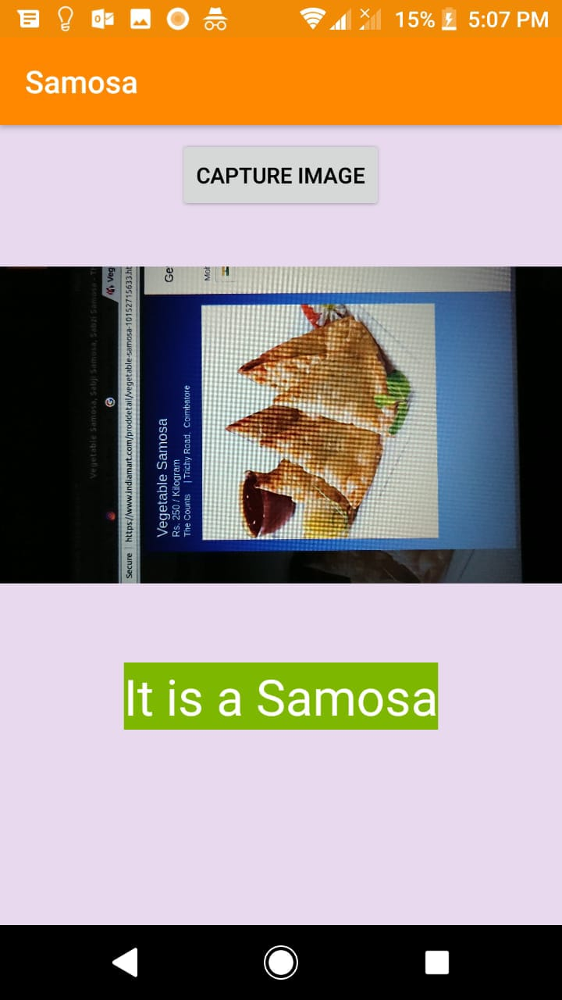

# samosa
Samosa detector

## What it does: 
This Android app aims to implement One-Class Classification locally on an Android device using TFlite. It uses an Autoencoder to find out if the image is a Samosa

## Prerequisites:
1. To run the apk, you need an Android device running **Android Version 5.1 or above**
2. To build this app in Android Studio, you need to add the **TFlite dependencies**

## Author(s):
**Divyanshu Sharma**

## Images:

